# HighFive 소개

|                                                                   FE                                                                    |                                                                   FE                                                                   |                                                                  BE                                                                  |                                                                 BE                                                                 |                                                                    BE                                                                     |
|:---------------------------------------------------------------------------------------------------------------------------------------:|:--------------------------------------------------------------------------------------------------------------------------------------:|:------------------------------------------------------------------------------------------------------------------------------------:|:----------------------------------------------------------------------------------------------------------------------------------:|:-----------------------------------------------------------------------------------------------------------------------------------------:|
| <a href="https://github.com/duckddud213"></a> | <a href="https://github.com/sungjun-an"></a> | <a href="https://github.com/jjo2889"></a> | <a href="https://github.com/Nam4o"></a> | <a href="https://github.com/malrangcow00"></a> |
|                                            [Changyeong Yeo](https://github.com/duckddud213)                                             |                                              [sungjun-an](https://github.com/sungjun-an)                                               |                                                   [jy](https://github.com/jjo2889)                                                   |                                               [Jeonghw4n](https://github.com/Nam4o)                                                |                                               [MalrangCow](https://github.com/malrangcow00)                                               |

## 팀 그라운드 룰

|  | 룰 |
| --- | --- |
| 1. | 적극적인 아침인사 나누기 |
| 2. | 지각 시 페널티 부여 !! |
| 3. | 출결현황 서로 챙겨주기 |
| 4. | 프로젝트 진행 상황 및 이슈 매일 공유하기 |

## 스프린트

### <assets src="assets/JIRA-icon.png" width="20px" height="20px"> [JIRA](https://ssafy.atlassian.net/jira/software/c/projects/S10P12D203/boards/5238/timeline)
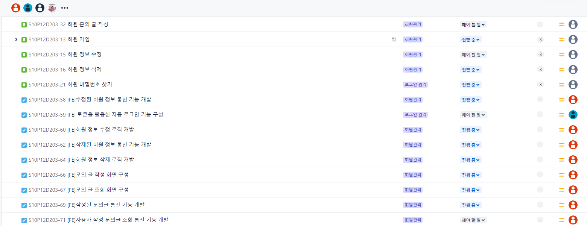

### <assets src="assets/Gerrit-icon.png" width="20px" height="20px"> [Gerrit](https://i10d203.p.ssafy.io:8989/q/status:open+-is:wip)
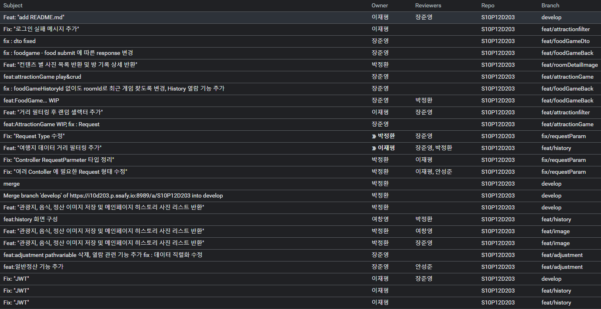

### <assets src="assets/conf-icon.png" width="20px" height="20px"> 회의
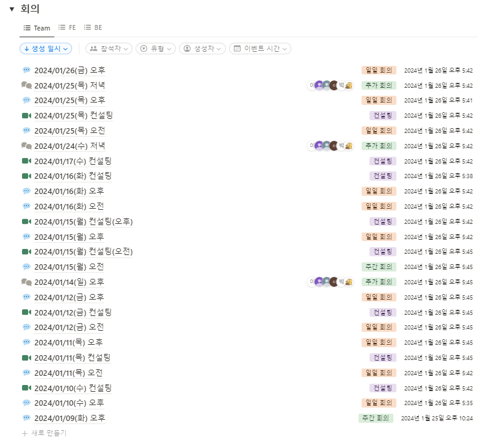

### <assets src="assets/sprint-icon.png" width="20px" height="20px"> 스프린트 회고


# <assets src="assets/project_name.png" width="50%">
<assets src="assets/logo.png" width="300px" height="300px">

# 목차

- [프로젝트 개요](#프로젝트-개요)
- [기능 명세서](#기능-명세서)
- [개발 환경](#개발-환경)
- [컨벤션](#컨벤션)
- [ERD](#erd)
- [API 명세서](#api-명세서)

# 프로젝트 개요

색다른 여행 경험을 갖고 싶은 이들을 위한 랜덤 행선지 추천 서비스  
진행기간 : 2024.1.8 ~ 2024.1.16 (6주)

[Figma](https://www.figma.com/file/SHB1VDOav5LXTBrMSOjICK/HighFive?type=design&node-id=0-1&mode=design&t=wQEv1NdNMolBqSH1-0)   

### 서비스 화면
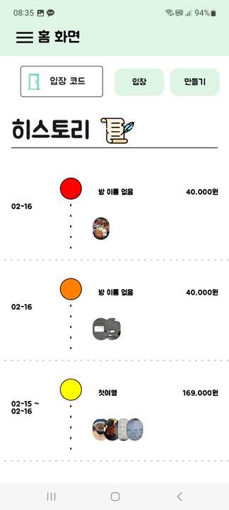
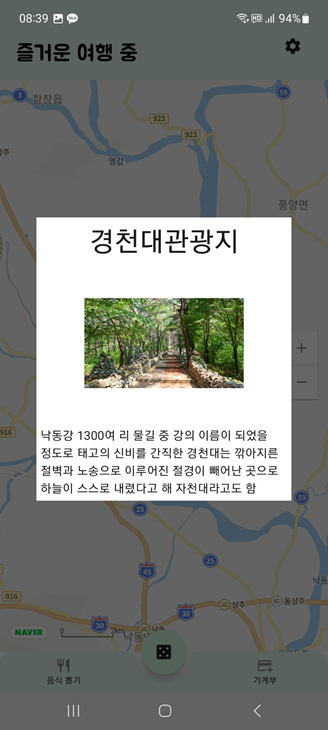
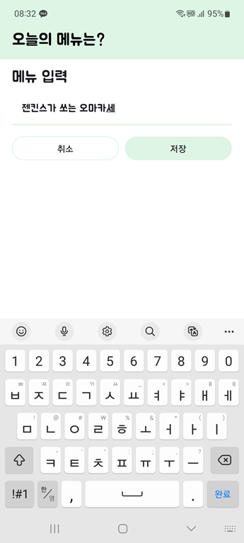
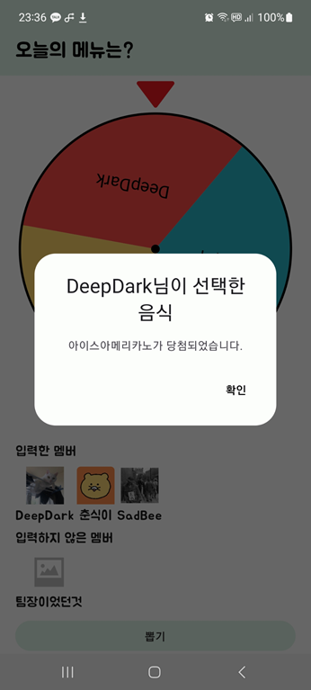
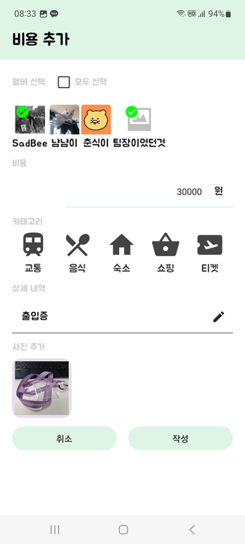  

# 기능 명세서


# 개발 환경

- Collaboration Tool  
  
  
  
  
  
- Frontend Environment

    |  | Environment | version |
    | --- | --- | --- |
    | Kotlin |  | 1.9.0 |
    | IDE | Android Studio | Hedgehog 2023.1.1 Patch 1 |
    | KSP |  | 1.9.0-1.0.12 |
    | AGP |  | 8.2.1 |
    | Dependencies | Glide | 1.0.0-beta01 |
    |  | Hilt | 2.48 |
    |  | StompProtocolAndroid | 1.6.6 |
    |  | retrofit2 | 2.9.0 |
    |  | okhttp3 | 4.10.0 |
    |  | compose | 2.5.3 |
    |  | viewmodel | 2.5.1 |
    |  | android-roulette-wheel-view | 1.0.3 |
    |  | viewbinding |  |
    |  | lottie-compose | 1.4.1 |
    |  | LazyColumnScrollbar | 1.9.0 |
    |  | splashscreen | 1.0.1 |
    |  | material-icons-extended |  |
- Backend Environment

    |  | Environment | version                                           |
    | --- | --- |---------------------------------------------------|
    | Java | Open JDK | 17                                                 |
    | IDE | IntelliJ | Ultimate                                          |
    | Framework | Spring Boot | 3.2.2                                             |
    | Library | Spring Security |                                                   |
    |  | Spring Data JPA |                                                   |
    |  | Hibernate Validator (Jakarta EE 버전) |                                                   |
    |  | Java Mail Sender |                                                   |
    |  | jjwt |                                                   |
    | Dependencies | spring-boot-starter-data-jpa |                                                   |
    |  | spring-boot-starter-security |                                                   |
    |  | spring-boot-starter-web |                                                   |
    |  | spring-boot-starter-mail |                                                   |
    |  | spring-boot-starter-validation |                                                   |
    |  | mysql-connector-java |                                                   |
    |  | lombok |                                                   |
    |  | jjwt |                                                   |
    | application.yml | Security Configuration |  |
    |  | Mail Configuration | Java Mail Sender                                  |
    | DB | MySQL Server | 8.0.36                                            |
    |  | AWS RDS |                                                   |
    |  | Redis |                                                   |

# 서버 인프라

**서버 시스템 구성도**

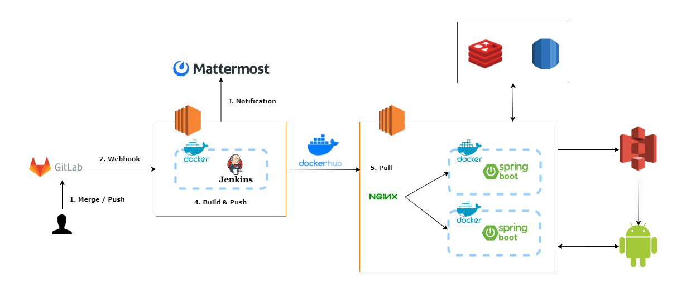

# 컨벤션

- API Conventions
  - parameter = camel
  - url = kebab
- Commit Conventions  
    [Gerrit](https://i10d203.p.ssafy.io:8989/q/status:open+-is:wip)
    - master
      - 머지만 가능
    - develop
      - 머지만 가능
    - feat
      - feat/{branch명(기능)} 으로 branch 생성
      - develop으로 머지 후 브랜치 삭제
    - fix
      - 수정사항이 있으면 fix/{branch명}으로 branch 생성
      - develop으로 머지 후 브랜치 삭제

    ###### Commit message 규칙
    ```
      Feat: 로그인 기능 구현

      SNS로그인 기능, 이메일 로그인 기능 구현

      Task: S10P12D203-15

      changeid: adksjhfoiwque341231
    ```
- Frontend Conventions

    ###### Kotlin Coding Conventions
    
    | 번호 | 규칙 | 예시 |
    | --- | --- | --- |
    | 1 | 공통적인 루트 패키지는 생략한다. | network/socket (org.example.kotlin 생략) |
    | 2 | Source File 명은 PascalCase로 작성한다. | ProcessDeclarations.kt |
    | 3 | Class와 Object 명은 PascalCase로 작성한다. | object EmptyDeclarationProcessor |
    | 4 | 함수 이름은 camelCase로 작성한다. | var declarationCount |
    | 5 | const 변수나 최상위 val 변수는 Screaming snake case로 작성한다. | const val MAX_COUNT = 0 |
    | 6 | 들여쓰기는 탭 또는 스페이스 4번으로 한다. |  |
    | 7 | class 이름은 명사, 메소드 이름은 동사로 작성한다. | class List, fun readPersons() |
    | 8 | 함수의 로직이 1줄이라면 =을 통해 표현한다 | fun foo() = 1 |
- Backend Conventions

  ###### Java Coding Conventions

  - Class명은 PascalCase 로 작성한다.  
  `MyClass`
  - API URL, Parameter는 kebab-case로 작성한다.  
  `api-url, parameter-name`
  - 함수명, 변수명은 camelCase로 작성한다.  
  `myFunction, variableName`
  - 주석은 설명하려는 구문에 맞춰 들여쓰기 한다.  
  statement에 관한 주석
  - 연산자 사이에는 공백을 추가하여 가독성을 높인다. | a + b + c + d |
  - 콤마 다음에 값이 올 경우 공백을 추가하여 가독성을 높인다. | var arr = [1, 2, 3, 4] |
  - ENUM이나 상수는 대문자로 작성한다. | NORMAL_STATUS = 10 |
  - 생성자 함수명의 맨 앞글자는 대문자로 작성한다. | function Person() {} |
  - 함수명은 소문자로 시작하고 동사로 작성한다. | function getUserId() {} |
  - 주석은 설명하려는 구문에 맞춰 들여쓰기 한다.
    ```
    // Good
    function someFunction() {
        
        // statement에 관한 주석
        statements
    }
    ```
  - 연산자 사이에는 공백을 추가하여 가독성을 높인다.
    ```
        a+b+c+d // bad
        a + b + c + d // good
    ```
  - 콤마 다음에 값이 올 경우 공백을 추가하여 가독성을 높인다.
    ```
    var arr = [1,2,3,4]; //bad
    var arr = [1, 2, 3, 4]; //good
    ```

  - ENUM이나 상수는 대문자로 작성한다.
    
    ```
        NORMAL_STATUS = 10;
    ```
    
  - 생성자 함수명의 맨 앞글자는 대문자로 작성한다.
        
    ```
        function Person(){}
    ```
    
  - 함수명은 소문자로 시작하고 동사로 작성한다.
        
    ```
        function getUserId(){}
    ```
    
  - 패키지는 계층형구조로 구성한다.

     

      - Controller에서는 최대한 어떤 Service를 호출할지 결정하는 역할과 Exception처리만을 담당  
          Controller 단에서 로직을 구현하는 것을 지양한다.
      - 하나의 메소드와 클래스는 하나의 목적을 두게 만든다  
          하나의 메소드 안에서 한가지 일만 해야한다.  
          하나의 클래스 안에서는 같은 목적을 둔 코드들의 집합이여야한다.
      - 메소드와 클래스는 최대한 작게 만든다.  
          메소드와 클래스가 커진다면 하나의 클래스나 메소드 안에서 여러 동작을 하고 있을 확률이 크다.  
          수많은 책임을 떠안은 클래스를 피한다. 큰 클래스 몇 개가 아니라 작은 클래스 여럿으로 이뤄진 시스템이 더욱 바람직하다.  
      - 도메인 서비스를 만들어지는 것을 지양  
          User라는 도메인이 있을 때, UserService로 만드는 것을 피한다.  
          이렇게 도메인 네이밍을 딴 서비스가 만들어지면 자연스레 수많은 책임을 떠안은 큰 클래스로 발전될 가능성이 높다.  
          기능 별로 세분화해서 만들어보자. (UserRegisterService, UserEmailService 등...)
      - 에러 검출(try - catch)  
          최상단에서 에러 검출 하기  
          ex) 컨트롤러 서비스 DAO가 있으면 컨트롤러에서 try -catch문 작성
      - 복합문
        복합문은 중괄호 { statements } 로 둘러쌓여진 statements 이다.
        - 둘러싸여진 statements 은 한 단계 더 들여쓰기를 한다.
        - 여는 중괄호 { 는 한 칸 띄운 뒤 복합문을 시작하는 줄의 마지막에 위치한다.
        - 닫은 중괄호 } 는 새로운 줄에 써야하고, 복합문의 시작과 같은 들여쓰기를 한다.

      - if, if-else, if else-if else  
        if 문은 항상 중괄호를 사용한다.

      ```java
      if (condition) {
              // TODO : something..
      }
      if (condition1) {
              // TODO : something..
      }
      else if (condition2) {
              // TODO : something..
      } 
      else {
              // TODO : something..
      }
    
      // 아래와 같이 중괄호 {} 를 생략해서 사용하지 않는다.
      if (condition)
      // TODO : something..
      if (condition) something..
      ```

     - 한 줄 띄우기  
       한 줄을 띄우고 코드를 작성하면 논리적으로 관계가 있는 코드들을 쉽게 구분할 수 있기 때문에 코드의 가독성을 향상시킨다.
      - 메서드들 사이에서
      - 메서드 안에서의 지역 변수과 그 메서드의 첫 번째 문장 사이에서
      - 블록 주석 또는 한 줄 주석 이전에
      - 가독성을 향상시키기 위한 메서드 내부의 논리적인 섹션들 사이에서

      - 공백  
        괄호와 함께 나타나는 키워드는 공백으로 나눈다.

      ```java
      if (condition) {
              // TODO : do something...
      }
      ```

      - 메서드명과 메서드를 여는 괄호 사이에는 공백을 사용하지 않는다.이렇게 하는 것은 메서드 호출과 키워드를 구별하는데 도움을 준다.

      ```java
      callMethod (arg1);      // 잘못된 사용법
      callMethod(arg1);       // 올바른 사용법
      ```

      - 공백은 인자리스트에서 콤마 이후에 사용한다.

      ```java
      callMethod(arg1, arg2);
      ```

      - 변수의 타입을 변환하는 cast 의 경우 공백으로 구분한다.

      ```java
      callMethod((byte) num);
      ```


# ERD
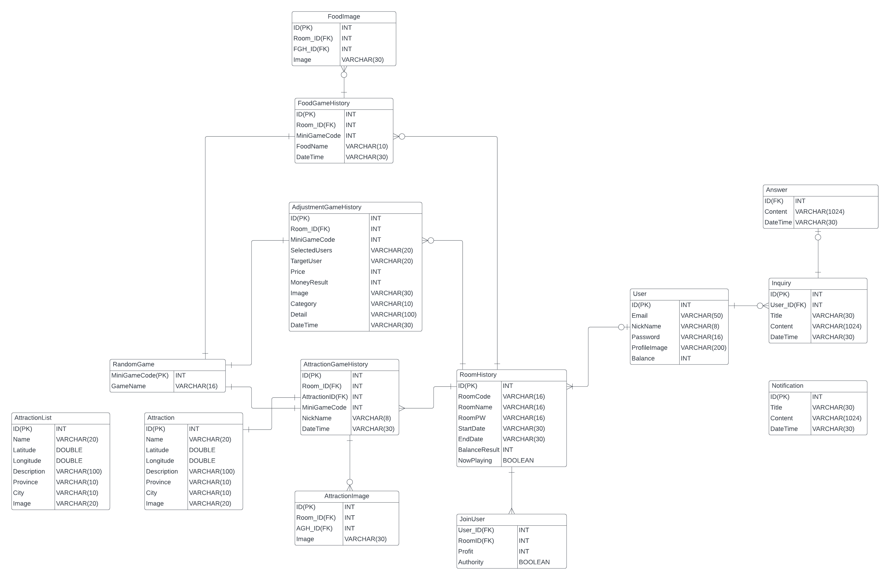

# API 명세서
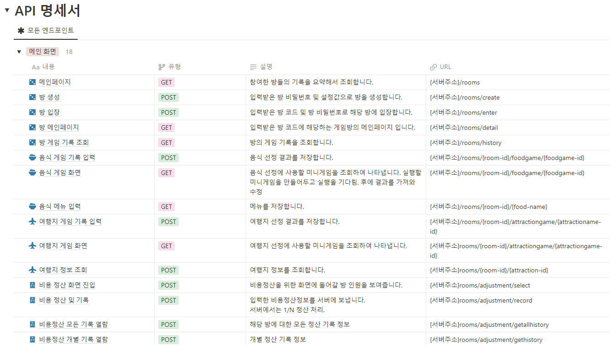
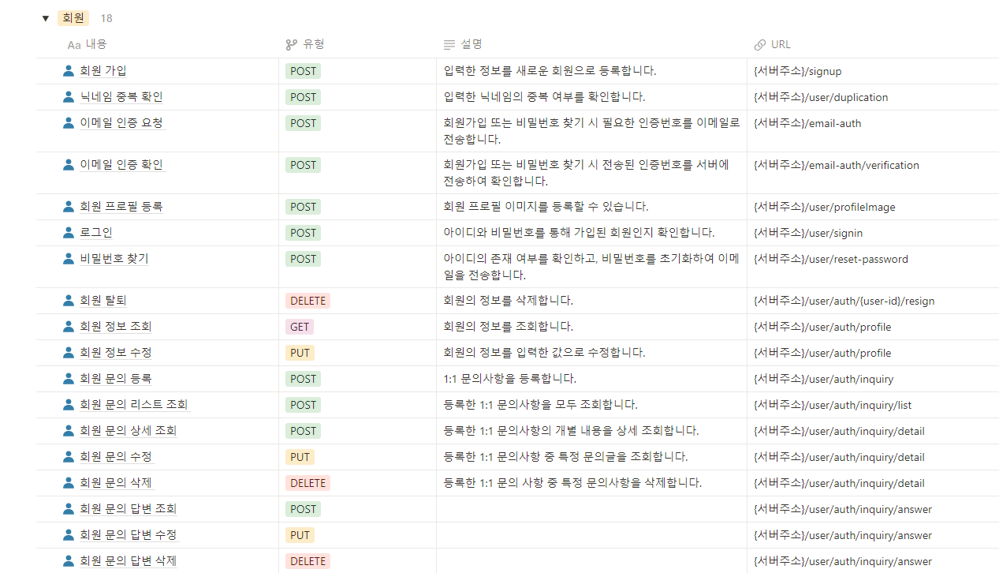


